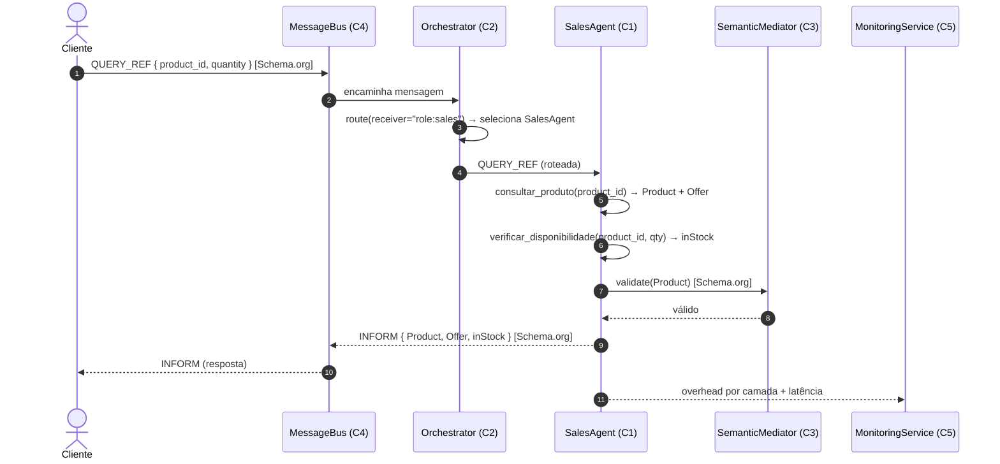
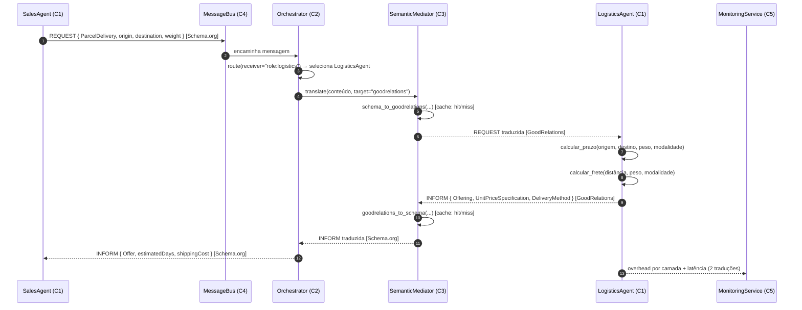
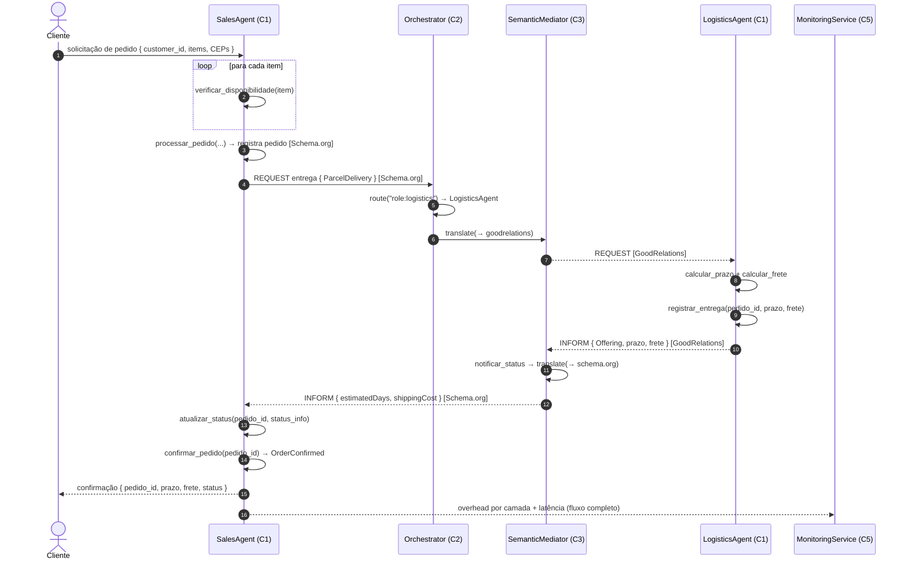

# Casos de Uso — Diagramas de Sequência (IIAE-BR)

Este documento descreve os **três casos de uso** do estudo de caso
(seção 3.3) e seus **diagramas de sequência**, evidenciando o percurso
das mensagens **FIPA-ACL** pelas **cinco camadas** da arquitetura
IIAE-BR e, em especial, a **mediação semântica** entre os vocabulários
**Schema.org** (Agente de Vendas) e **GoodRelations** (Agente de
Logística), realizada pela Camada 3.

Implementação de referência: [`src/simulation/use_cases.py`](../src/simulation/use_cases.py)
(`UseCaseSimulator`).

## Participantes (atores e componentes)

| Participante | Camada | Papel |
|---|---|---|
| **Cliente** | — | Origem da requisição (comprador) |
| **SalesAgent** | 1 — Aplicação | Agente de Vendas (vocabulário **Schema.org**) |
| **LogisticsAgent** | 1 — Aplicação | Agente de Logística (vocabulário **GoodRelations**) |
| **Orchestrator** | 2 — Orquestração | Roteamento FIPA-ACL (registry + load balancer) |
| **SemanticMediator** | 3 — Interoperabilidade | Tradução Schema.org ⇄ GoodRelations + cache |
| **MessageBus** | 4 — Comunicação | Transporte FIPA-ACL / JSON-LD |
| **MonitoringService** | 5 — Infraestrutura | Observabilidade (latência, overhead) |

Convenções de notação:

- `REQUEST`, `QUERY_REF`, `INFORM` etc. são **performativas FIPA-ACL**.
- `Schema.org{…}` / `GoodRelations{…}` indicam o **vocabulário** do conteúdo.
- As traduções ocorrem **exclusivamente** na Camada 3 (Mediador Semântico);
  os agentes de aplicação nunca conhecem o vocabulário do par.

---

## UC1 — Consultar Produto e Disponibilidade

Fluxo **intra-vocabulário** (Schema.org). Não há tradução semântica; a
Camada 3 apenas valida a entidade no vocabulário do Agente de Vendas.

**Camadas percorridas:** C4 → C2 → C1 → C3 (validação) → C5
(monitoramento). **Traduções semânticas:** 0.

---

## UC2 — Calcular Prazo e Frete (com tradução semântica)

Caso de uso **central** para a interoperabilidade: o Agente de Vendas
fala **Schema.org** e o Agente de Logística fala **GoodRelations**. O
Mediador Semântico (Camada 3) realiza **duas traduções**: Schema.org →
GoodRelations na requisição e GoodRelations → Schema.org na resposta.

**Camadas percorridas:** C1 → C4 → C2 → **C3 (tradução →)** → C1 →
**C3 (tradução ←)** → C2 → C5. **Traduções semânticas:** 2
(Schema.org → GoodRelations e GoodRelations → Schema.org).

> O *overhead* da Camada 3 depende da **taxa de acerto do cache
> semântico**: em *cache hit* o custo de tradução é mínimo; em *cache
> miss* a tradução é efetivamente computada (custo maior). A análise de
> sensibilidade avalia 0%, 50%, 60%, 80% e 95%.

---

## UC3 — Processar Pedido (ponta a ponta)

Integra UC1 (disponibilidade) e UC2 (cálculo de entrega com tradução
semântica), acrescentando o **registro do pedido**, a **notificação de
status** e a **confirmação** final.

**Camadas percorridas:** todas as cinco (C1–C5). **Traduções
semânticas:** 2. **Comportamentos acionados:**

- *SalesAgent*: `verificar_disponibilidade`, `processar_pedido`,
  `atualizar_status`, `confirmar_pedido`;
- *LogisticsAgent*: `calcular_prazo`, `calcular_frete`,
  `registrar_entrega`, `notificar_status`.

---

## Mapeamento Semântico (Camada 3)

Exemplos de termos traduzidos pelo `OntologyMapper`
(Schema.org → GoodRelations):

| Schema.org | GoodRelations |
|---|---|
| `Product` | `gr:ProductOrService` |
| `Offer` | `gr:Offering` |
| `price` | `gr:hasCurrencyValue` |
| `priceCurrency` | `gr:hasCurrency` |
| `availability` | `gr:hasInventoryLevel` |
| `sku` | `gr:hasStockKeepingUnit` |
| `deliveryMethod` | `gr:availableDeliveryMethod` |
| `shippingCost` | `gr:hasCurrencyValue` |

A tradução inversa (GoodRelations → Schema.org) é aplicada às respostas
da logística, devolvendo entidades `Offer` ao Agente de Vendas. Todo o
conteúdo trafega serializado em **JSON-LD** pela Camada 4.
